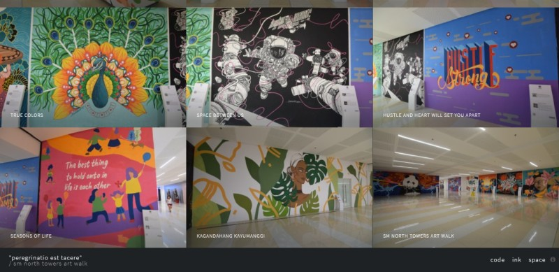

The premier issue of the first volume in the series. 
(current Pomodoro session at 5 minutes left so get to work!)

### &lt;/code&gt;
* Static Site Generators are [the future][1].
* I like [GitKraken][2] but it can be really slow. Learning to live with it.
* My love affair with [WordWeb][3] continues in Android and iOS. I want to dig up my old hard disks to remember when we first met.

### "ink"
> "Either write something worth reading or do something worth writing."
> 
> &mdash; Benjamin Franklin, author & inventor

 

### \**space*\*

[1]:https://code-ink-space.gitlab.io/code/2019/static-site-generator-jekyll-hexo-hugo/
[2]:https://www.gitkraken.com
[3]:https://wordweb.info/