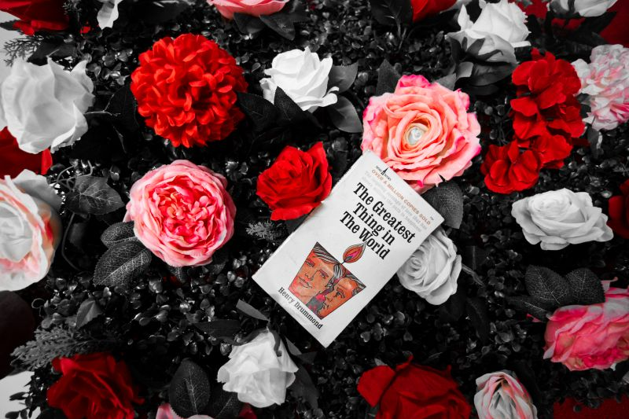

The dystopian industrial society in ["Alita: Battle Angel"][1] is very probable. (At least they didn't show the brutal death of the dog in the live-action film.) 

### &lt;/code&gt;
- Made my first answer at [Stack Overflow][2] after 8 years and earned my first 4 badges: Census, Informed, Autobiographer, Teacher. Currently tracking Enthusiast badge.
> "Be kind and friendly.
Avoid sarcasm and be careful with jokes — tone is hard to decipher online. If a situation makes it hard to be friendly, stop participating and move on.
>
> &mdash; "Stack Overflow: Code of Conduct
- I now have 7 sites up online powered by [Static Site Generators (SSG)][3]. More coming. It's a great time to be a webmaster.

### *"ink"*
> **Our reasoning is context-dependent and mostly based on simple heuristics.**
> 
> Humans are ill-equipped to handle the probabilistic reasoning required by today’s high-information environment. Despite what we may believe, our mind is not a sophisticated thinking-machine, but rather a patchwork of rules and shortcuts called heuristics.
> 
> These heuristics have evolved to help us make quick decisions when needed instead of contemplating needlessly: If you encounter a tiger in the jungle, it may be wise just to run and not ponder the details of the situation.
> 
> Unfortunately, the price we pay for using these lazy shortcuts is that our reasoning becomes irrational and marred by what psychologists call biases. For example, due to attribution bias, we tend to disproportionately ascribe successes to our own abilities, and failures to “bad luck”.
> 
> Our thinking also becomes path dependent, meaning that the route with which we arrive at a given situation dictates how we think about it.
> 
> For instance, if you were to win $5 million today and lose $4 million tomorrow, you would likely be much less happy than if you simply won $1 million tomorrow, although the end result is identical.
> 
> Path dependency also means we cling to our existing opinions. Scientists and politicians tend to get attached to the ideas they advocate, and refuse to change their minds even in the face of contradictory information.
> 
> From an evolutionary perspective, it makes sense that we get attached to things we have invested a lot of time and effort into, e.g. our children, but this inclination can also be counterproductive. It should be possible and acceptable to change our minds and contradict ourselves at will.
>
> &mdash; excerpt from the Blinkist summary of Nassim Nicholas Taleb's "Fooled by Randomness" (2005)

 

### \***space**\*

 

[The Greatest Thing in The World][space]

[space]:https://www.instagram.com/p/Bt0781QgWDi/
[1]:https://www.imdb.com/title/tt0437086/
[2]:https://stackoverflow.com/
[3]:https://www.staticgen.com/
