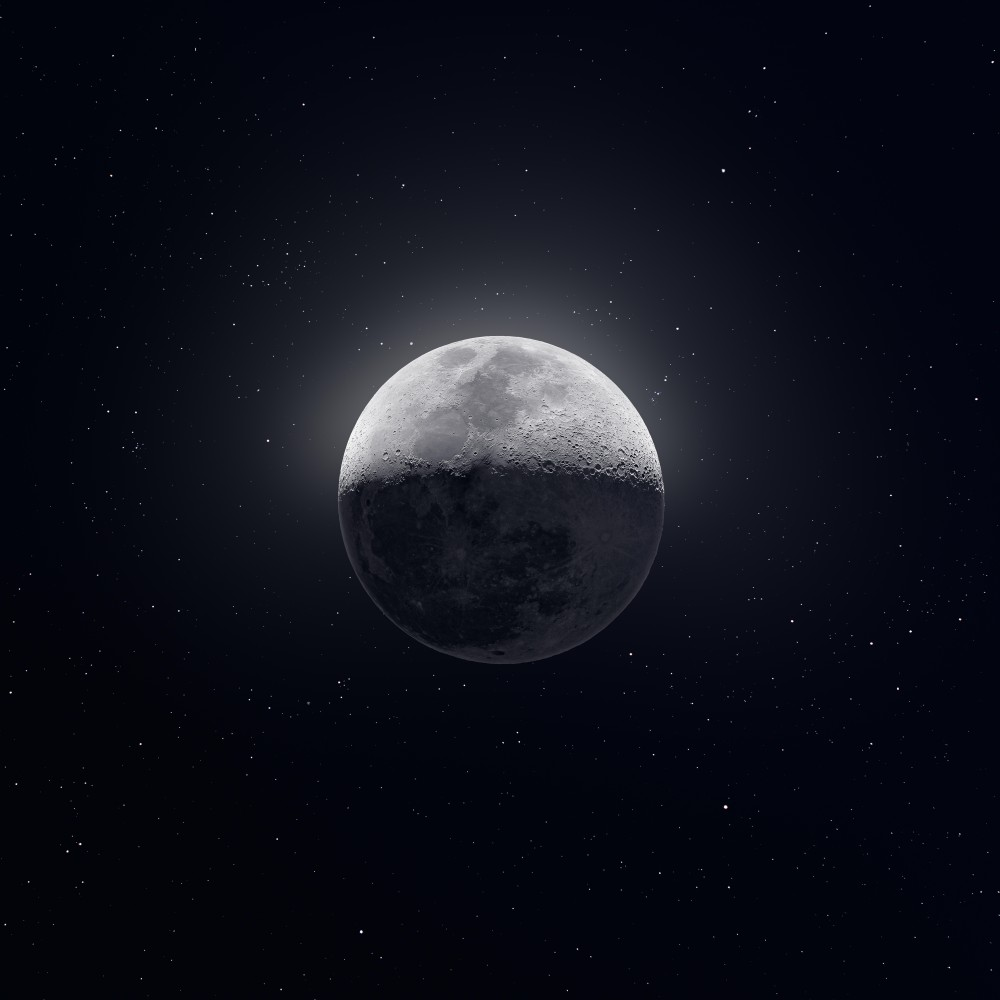

The Lego Movie 2 was a bit of a letdown. Indeed, everything is not awesome.

### &lt;/code&gt;
- Apple's iPad mini 5 may actually launch [in 2019][1] - Yes, please.
- Add [Google Analytics][2] tracking codes to Hugo, Gatsby, Hexo and Jekyll sites - Done!
- [realfavicongenerator.net][3] is so helpful.

 

### *"ink"*
> Court Of Conscience is a concept developed by 17th-century European theology. The concept held that one's conscience would testify for or against one's actions in life after death. During life, the faculty of conscience was like, but not the same as, the voice of God. It drew on divine knowledge and precepts, and applied these laws in order to direct the individual toward right action and warn against wrong action. After life, the function of conscience was that of a record—animated, if you will—that would speak to a divine tribunal, in judgment for or against you. Even if one's conscience was or seemed dormant (inactive, flawed, 'seared', asleep, etc.) during one's life—as was said to be the case in the worst of villains—it came fully to life with a perfect and true memory of all one's actions before God.
> 
> &mdash; Wikipedia (not a book but it's an encyclopedia!)

 

### \***space**\*

 

[I took nearly 50,000 images of the night sky to make an 81 Megapixel image of Tuesday's moon.][space]
Instagram: [Andrew McCarthy][4]

Equipment:
Sony a7ii (mirrorless camera),
ZWO ASI 224MC (CCD camera),
Orion XT10 (Dobsonian telescope),
Skywatcher EQ6-R Pro (tracking mount for telescope)

[space]:https://www.reddit.com/r/space/comments/arer0k/i_took_nearly_50000_images_of_the_night_sky_to/
[1]:https://www.techradar.com/news/ipad-mini-5
[2]:https://analytics.google.com/
[3]:https://realfavicongenerator.net/
[4]:https://www.instagram.com/cosmic_background/
