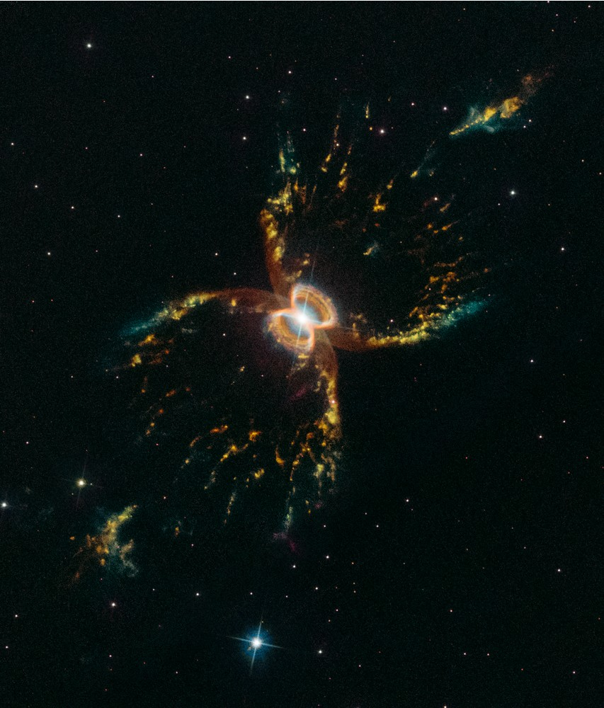

6.1 magnitude earthquake! April 22, 2019 at 5:11pm - my first time to actually feel an earthquake. Stopped watching *Little Men* on Amazon Prime Video because TV power got interrupted. 6.5 magnitude earthquake in Visayas the following day.

### &lt;/code&gt;
- [Smart DNS Proxy][1] trial signup. Using Singapore and South Korea servers.
- [Fake Name Generator][2] - is this even legal?
- DigitalOcean 60-day trial signup with 100 USD credit from TWiT. Paymaya VISA was considered a prepaid card and not accepted. Used Gcash AMEX instead. Banned from DigitalOcean. Wow. They're merciless huh. AWS it is then or Linode.
- Photobook Philippines - another 8" x 6" Small Landscape Softcover Photobook, 40 Pages - purchased for cousin's baptism.
- [ExpressVPN][3] 7-day trial activated.

 

### *"ink"*
> "When we are really honest with ourselves we must admit that our lives are all that really belong to us. So it is how we use our lives that determines what kind of men we are. It is my deepest belief that only by giving our lives do we find life. I am convinced that the truest act of courage, the strongest act of manliness is to sacrifice ourselves for others in totally nonviolent struggle for justice. To be a man is to suffer for others. God help us to be men!
> 
> &mdash; Cesar Chavez, farmworker, in **All Saints** (1997) by Robert Ellsberg

 

### \***space**\*

 

[Hubble celebrates 29th anniversary by looking at the Southern Crab Nebula][space]

[space]:http://hubblesite.org/image/4384/news_release/2019-15
[1]:https://www.smartdnsproxy.com/
[2]:https://www.fakenamegenerator.com/
[3]:https://www.expressvpn.com
