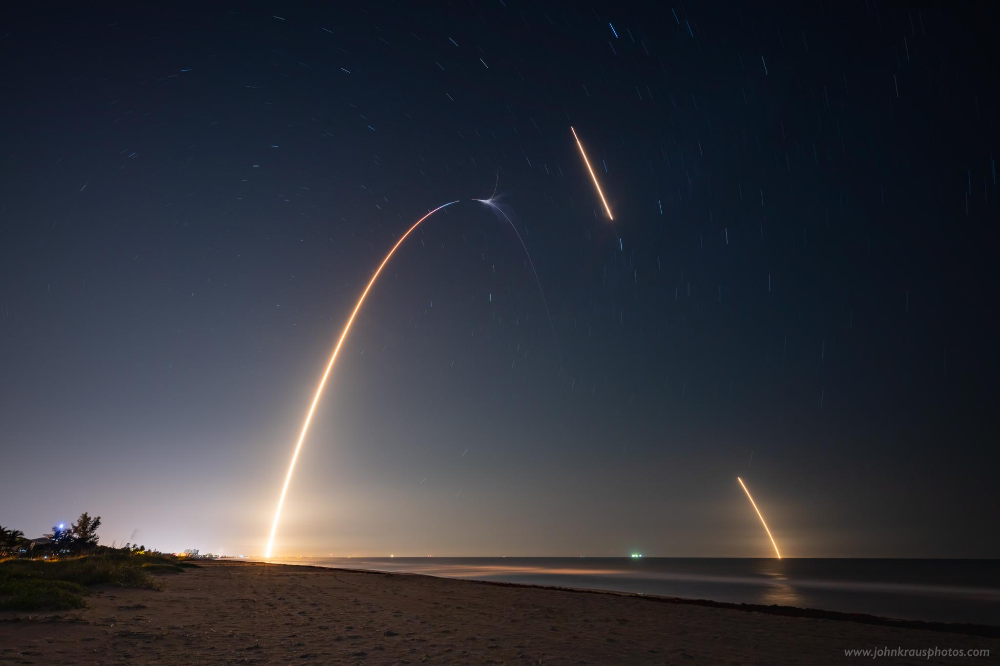

Watched *The Ultimate Gift (2006)* on The Roku Channel. Underappreciated flick. Also, *The Perfect Game (2009)* and *Saint Ralph (2004)* on Prime Video. Some really nice hidden gems.

### &lt;/code&gt;
- Smart Sakto Data 99 Promo offers 70 call minutes to Smart/TNT/Sun + 500MB data, valid for 30 days or 1 month.
> SAKTODATA99 to 9999
- Had my first [Google Duo][1] video call with mother in the province. It's fine.
- Comelec precinct finder is down.
- Smart DNS Proxy trial ends. Setting up [Unlocator][2]... doesn't unblock Philo and Pluto TV apparently.
- Downloaded Audible app for iPad iOS 10. Got the last compatible version using iTunes for PC.
- Installed on iPad several UK apps: BBC iPlayer, iTV Hub, All 4, etc.
- Started Kindle Unlimited subscription promo - 1 USD only for 2 months paid with GCash AMEX.
> You can keep up to 10 titles at a time. You can always get another by returning one that you currently have.
- 2019 Reading Challenge
> Congrats! You have read 33 books of your goal of 33! &mdash; [Goodreads][3]

 

### *"ink"*
> The breeze at dawn has secrets to tell you. Don't go back to sleep.
> 
> &mdash; **Rumi** in **365 Days of Wonder: Mr. Browne's Book of Precepts** (2014) by R.J. Palacio

 

### \***space**\*

 

["Long exposure photograph I shot of this morning's SpaceX Falcon 9 launch and first stage landing on the droneship 12 miles off of Cape Canaveral!"][space] &mdash; johnkphotos

Bonus: [Rocket launch from earth as seen from the International Space Station][spacebonus] &mdash; Yeet69lasagna

[space]:https://www.reddit.com/r/space/comments/bkrkr4/long_exposure_photograph_i_shot_of_this_mornings/
[spacebonus]:https://www.reddit.com/r/space/comments/bkxowm/rocket_launch_from_earth_as_seen_from_the/
[1]:https://duo.google.com/
[2]:https://unlocator.com/
[3]:https://www.goodreads.com
